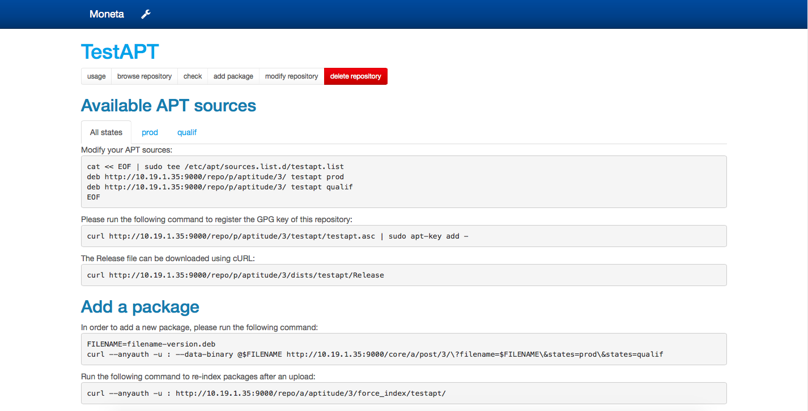

.. Moneta documentation master file, created by

Moneta
======

Moneta is a web application emulating different kinds of package repositories.
The goal is not to replace official mirrors like packages.debian.org or mirror.centos.org,
but to have a single location for all your Python/Java/Debian/RedHat private packages.

Repositories are created on-the-fly and you can limit upload rights to some groups of users.

Currently, you can create the following types of repositories:

  * Aptitude for Ubuntu or Debian systems,
  * Yum for CentOS, Fedora or Red Hat systems,
  * Maven for Java or Scala packages,
  * Pypi for Python packages,
  * Gem for Ruby packages,
  * Jetbrains for IntelliJ/PyCharm/PhpStorm/RubyMine/AppCode/CLion plugins,
  * Vagrant boxes,
  * any binary, versionned files.

.. image:: _static/index.png

.. image:: _static/package.png

table of contents
=================

.. toctree::
   :maxdepth: 1

   quick-installation
   requirements
   installation
   configuration
   changes

* :ref:`search`

