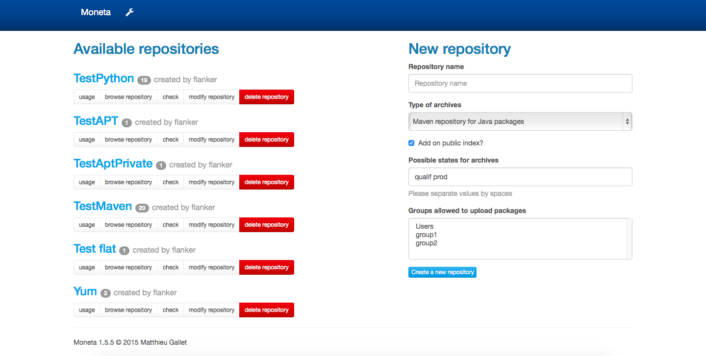
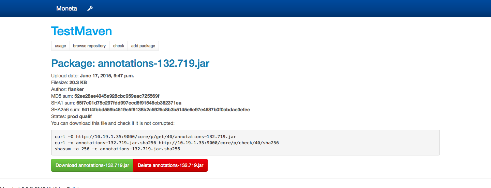

.. Updoc documentation master file, created by
   sphinx-quickstart on Wed Feb 13 11:51:12 2013.
   You can adapt this file completely to your liking, but it should at least
   contain the root `toctree` directive.

Welcome to Moneta's documentation!
==================================

Moneta is a web application emulating different kinds of package repositories.
The goal is not to replace official mirrors like packages.debian.org or mirror.centos.org, but to have a single location
for all your Python/Java/Debian/RedHat private packages.

Repositories are created on-the-fly and you can limit upload rights to some groups of users.

Currently, you can create the following types of repositories:

    * Aptitude for Ubuntu or Debian systems,
    * Yum for CentOS, Fedora or Red Hat systems,
    * Maven for Java or Scala packages,
    * Pypi for Python packages,
    * Jetbrains for IntelliJ/PyCharm/PhpStorm/RubyMine/AppCode/Clion plugins,
    * Gem for Ruby packages,
    * any binary, versionned files.

:doc:`installation`
    Instruction on how to get the distribution

:doc:`configuration`
    All configuration options

:doc:`debian`
    Packaging Moneta for Debian

.. image:: _static/apt.png

Full table of contents
======================

.. toctree::
   :maxdepth: 1

   installation
   configuration

Indices and tables
==================

* :ref:`genindex`
* :ref:`modindex`
* :ref:`search`
